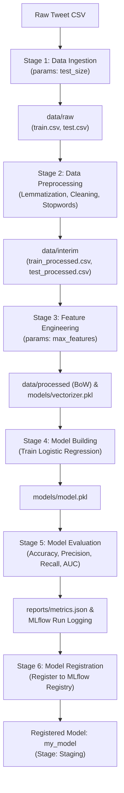

# End-to-End MLOps Pipeline: MLflow + DVC + DagsHub

An end-to-end Machine Learning Operations (MLOps) project demonstrating full lifecycle management of an NLP sentiment classification system — from data ingestion, preprocessing, and feature engineering to experiment tracking, automated pipeline orchestration, and model registry using **MLflow**, **DVC**, and **DagsHub**.

---

## Project Overview

* **Objective:** Binary text emotion classification (predicting `happiness` vs. `sadness` from tweet content).
* **Dataset:** Tweet emotions dataset (filtered and normalized).
* **Core MLOps Stack:**
  * **MLflow:** Experiment tracking (parameters, metrics, artifacts) & Model Registry.
  * **DVC (Data Version Control):** Multi-stage pipeline automation (`dvc.yaml`), parameter management (`params.yaml`), and data/model versioning.
  * **DagsHub:** Remote hosting for Git, DVC remote storage, and central MLflow Tracking server.
  * **Modeling & NLP:** NLTK, Scikit-learn (Logistic Regression, MultinomialNB, Random Forest, Gradient Boosting, XGBoost).

---

## Architecture and Workflow



---

## Project Structure

```text
├── .dvc/                   <- DVC internal configuration and cache
├── .github/                <- CI/CD workflows (if configured)
├── data/
│   ├── raw/                <- Ingested train/test split data (managed by DVC)
│   ├── interim/            <- Cleaned & normalized text data (managed by DVC)
│   └── processed/          <- Feature matrices / BoW arrays (managed by DVC)
├── models/                 <- Trained vectorizer and serialized model pickles (managed by DVC)
│   ├── vectorizer.pkl
│   └── model.pkl
├── notebooks/              <- Standalone exploratory & experiment scripts
│   ├── exp1_baseline_model.ipynb <- Initial EDA and baseline modeling
│   ├── exp2_bow_vs_tfidf.py      <- Model & Vectorizer comparison logged to MLflow
│   ├── exp3_lor_bow_hp.py        <- Hyperparameter tuning (GridSearchCV + MLflow nested runs)
│   └── dagshub_setup.py          <- Helper to verify DagsHub MLflow connectivity
├── reports/
│   ├── metrics.json        <- Evaluation metrics (Accuracy, Precision, Recall, AUC)
│   └── experiment_info.json<- Metadata bridging evaluation run ID to registration stage
├── src/
│   ├── data/
│   │   ├── data_ingestion.py     <- Downloads, filters binary classes, splits train/test
│   │   └── data_preprocessing.py <- NLTK cleaning, lemmatization, regex normalization
│   ├── features/
│   │   └── feature_engineering.py<- Bag-of-Words (CountVectorizer) transformation
│   └── model/
│       ├── model_building.py     <- Model training (Logistic Regression)
│       ├── model_evaluation.py   <- Metrics calculation & remote MLflow logging
│       └── register_model.py     <- Model registration and stage transition (Staging)
├── dvc.yaml                <- Complete multi-stage pipeline definition
├── dvc.lock                <- DVC state file recording pipeline execution hashes
├── params.yaml             <- Centralized pipeline parameters
├── requirements.txt        <- Python dependencies
└── setup.py                <- Makes src installable as a local package
```

---

## Experiments Journey (`notebooks/`)

Before building the production pipeline, multiple experiments were tracked using MLflow:

1. **`exp1_baseline_model.ipynb`**: Baseline exploration establishing the NLP preprocessing pipeline and initial logistic regression metrics.
2. **`exp2_bow_vs_tfidf.py`**: Comparative analysis running 10 distinct child runs in MLflow:
   * **Feature Extractors:** Bag of Words vs. TF-IDF.
   * **Algorithms:** Logistic Regression, Multinomial Naive Bayes, XGBoost, Random Forest, and Gradient Boosting.
   * Logged accuracy, precision, recall, F1 score, model artifacts, and script snapshots.
3. **`exp3_lor_bow_hp.py`**: Hyperparameter tuning using `GridSearchCV` over Logistic Regression (`C`, `penalty`, `solver`) tracking each combination as a nested child run, logging the best run to the parent MLflow experiment.

---

## Automated DVC Pipeline (`dvc.yaml`)

The pipeline connects modular scripts into a reproducible graph:

| Stage | Command | Dependencies (`deps`) | Outputs (`outs` / `metrics`) | Parameters |
| :--- | :--- | :--- | :--- | :--- |
| **`data_ingestion`** | `python src/data/data_ingestion.py` | `src/data/data_ingestion.py` | `data/raw` | `data_ingestion.test_size` |
| **`data_preprocessing`** | `python src/data/data_preprocessing.py` | `data/raw`, `src/data/data_preprocessing.py` | `data/interim` | — |
| **`feature_engineering`** | `python src/features/feature_engineering.py` | `data/interim`, `src/features/feature_engineering.py` | `data/processed`, `models/vectorizer.pkl` | `feature_engineering.max_features` |
| **`model_building`** | `python src/model/model_building.py` | `data/processed`, `src/model/model_building.py` | `models/model.pkl` | — |
| **`model_evaluation`** | `python src/model/model_evaluation.py` | `models/model.pkl`, `src/model/model_evaluation.py` | `reports/metrics.json` *(metric)*, `reports/experiment_info.json` | — |
| **`model_registration`** | `python src/model/register_model.py` | `reports/experiment_info.json`, `src/model/register_model.py` | Registers `my_model` on DagsHub Model Registry | — |

---

## Step-by-Step Setup and Reproduction

### 1. Clone Repository and Setup Virtual Environment
```powershell
git clone https://github.com/sujat-khan/MLFlow-DVC-Dagshub-Project.git
cd MLFlow-DVC-Dagshub-Project

# Create and activate virtual environment
python -m venv myvenv
myvenv\Scripts\activate

# Install dependencies
pip install -r requirements.txt
```

### 2. Connect DagsHub and MLflow Remote
Initialize DagsHub integration (will prompt for token on first run if not authenticated):
```python
import dagshub
dagshub.init(repo_owner='sujat-khan', repo_name='MLFlow-DVC-Dagshub-Project', mlflow=True)
```

### 3. Run Experiments (Optional)
```powershell
python notebooks/exp2_bow_vs_tfidf.py
python notebooks/exp3_lor_bow_hp.py
```

### 4. Reproduce the Full Pipeline with DVC
To execute only modified stages or full reproduction:
```powershell
# Run the pipeline (executes only modified stages)
dvc repro

# Force reproduction of all stages
dvc repro -f
```

### 5. Inspect Pipeline Metrics
```powershell
# View latest metrics
dvc metrics show

# Compare metrics between commits / experiments
dvc metrics diff
```

---

## Key Takeaways and MLOps Best Practices Applied

1. **Decoupled Responsibilities:**
   * **Git** tracks code, configuration (`params.yaml`), pipeline graph (`dvc.yaml`), and lightweight evaluation reports (`reports/metrics.json`).
   * **DVC** tracks datasets (`data/`) and heavy model weights (`models/`) without bloating the Git repository.
   * **MLflow & DagsHub** manage experiment runs, parameters, metrics visualizations, and the central Model Registry.

2. **DVC and SCM Cache Separation:**
   * Heavy output folders (`data/raw`, `data/interim`, `data/processed`, `models/*.pkl`) are ignored by Git and managed by DVC.
   * Lightweight metrics (`reports/metrics.json`) use `cache: false` in `dvc.yaml` so Git can version metrics and compute diffs across commits.

3. **Robust Model Serialization:**
   * Models are logged to MLflow with explicit `cloudpickle` serialization (`serialization_format="cloudpickle"`) to ensure 100% compatibility across third-party algorithms (Scikit-learn, XGBoost, LightGBM).

4. **Automated Model Registry Flow:**
   * `model_evaluation.py` outputs run metadata to `reports/experiment_info.json`.
   * `register_model.py` reads the active run ID, registers `my_model` on DagsHub, and automatically transitions the version stage to **Staging**.

---


[References](https://github.com/campusx-official/mlops-mini-project/tree/master)
